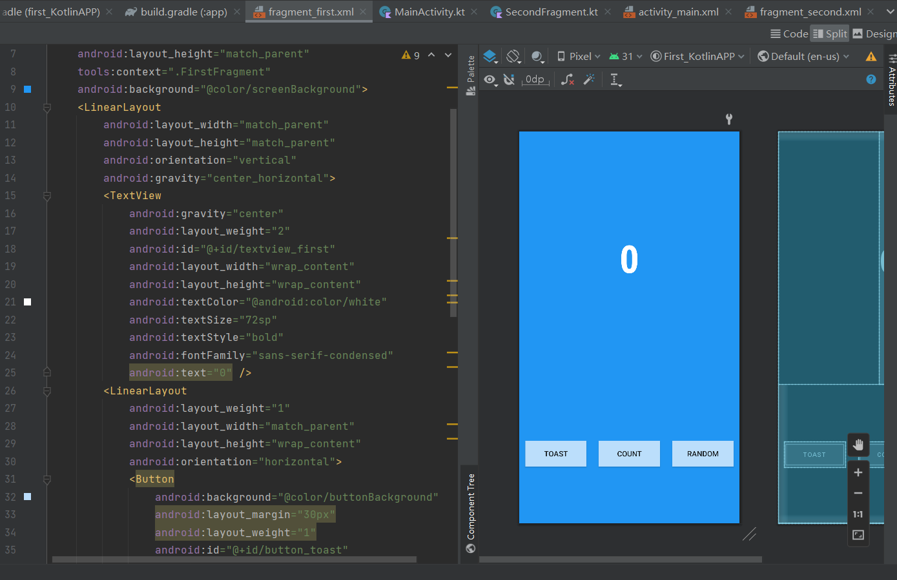
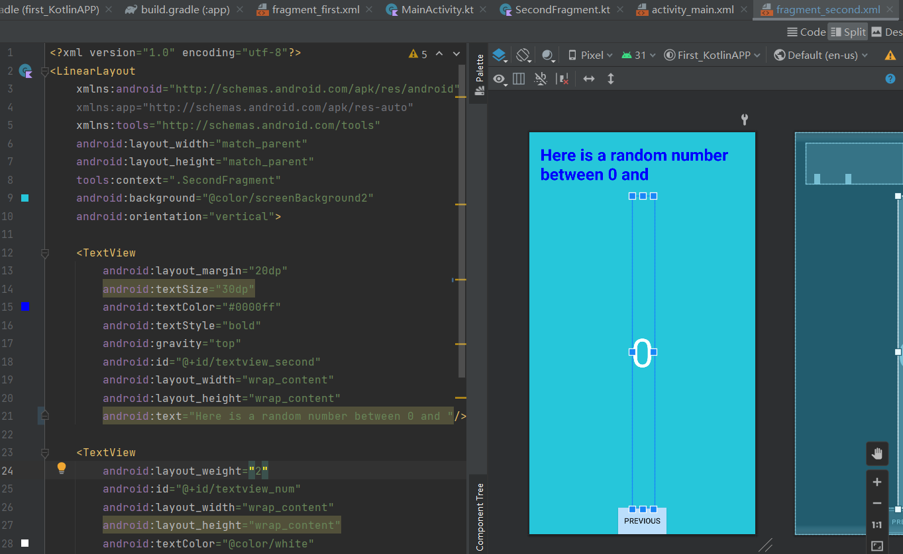
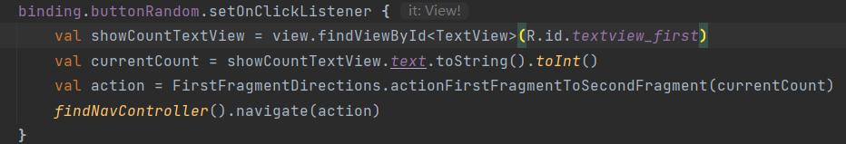
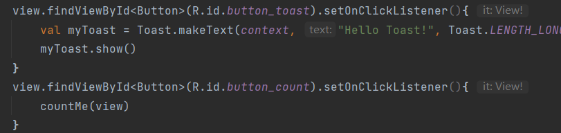
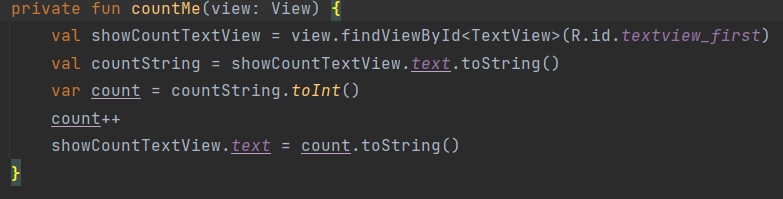
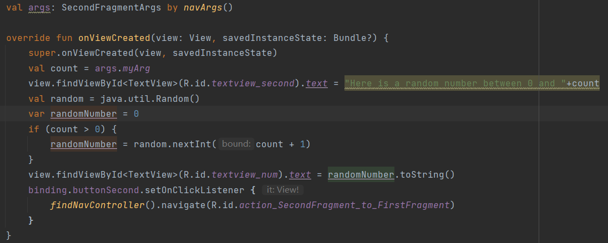
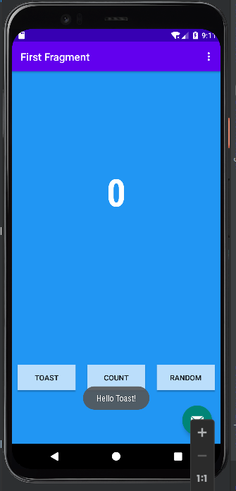
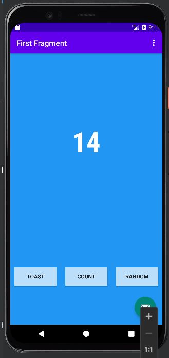
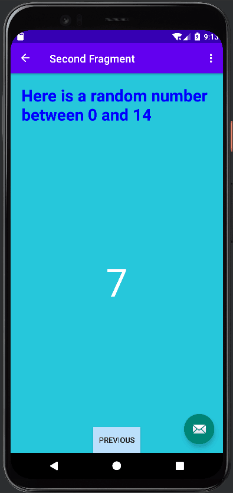

# 第一个kotlin应用
## 1.构建页面
根据要求将布局文件编写好，由于本人使用线性布局比较熟练所以使用了线性布局。

## 2.编写功能代码
### 1.点击random获取fristfragment中TextView的数据，并传输并跳转至secondfragment。

### 2.实现点击toast弹出toast，点击count在上方TextView显示点击次数。

### 3.实现在secondfragment接收参数并显示在topTextView中，并生成0-x的随机数显示在中间的TextView中。

## 功能展示
### 1.toast

### 2.count

### 3.random

