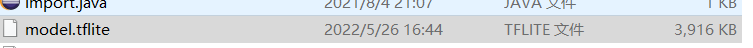
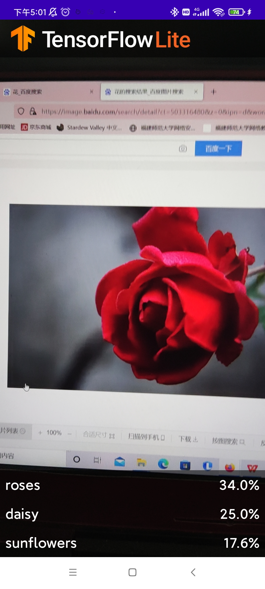
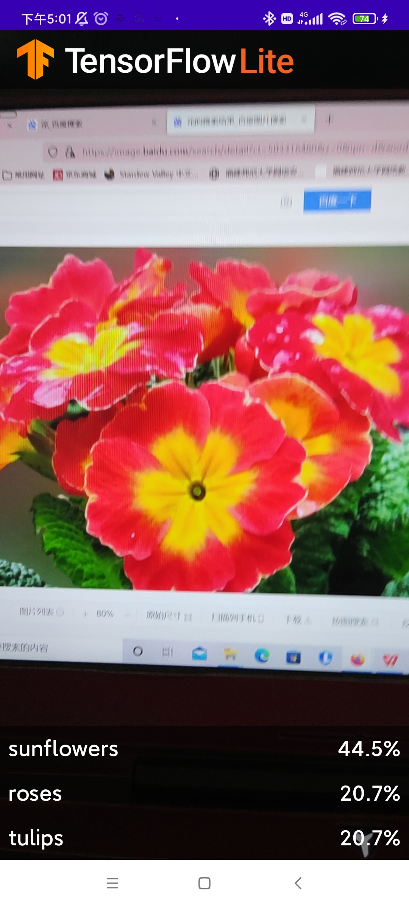

```python
!pip install tflite-model-maker
```

    Requirement already satisfied: tflite-model-maker in c:\users\86156\anaconda3\lib\site-packages (0.3.4)
    Requirement already satisfied: fire>=0.3.1 in c:\users\86156\anaconda3\lib\site-packages (from tflite-model-maker) (0.4.0)
    Requirement already satisfied: tf-models-official==2.3.0 in c:\users\86156\anaconda3\lib\site-packages (from tflite-model-maker) (2.3.0)
    Requirement already satisfied: tensorflow-hub<0.13,>=0.7.0 in c:\users\86156\anaconda3\lib\site-packages (from tflite-model-maker) (0.12.0)
    Requirement already satisfied: tensorflowjs>=2.4.0 in c:\users\86156\anaconda3\lib\site-packages (from tflite-model-maker) (3.18.0)
    Requirement already satisfied: sentencepiece>=0.1.91 in c:\users\86156\anaconda3\lib\site-packages (from tflite-model-maker) (0.1.96)
    Requirement already satisfied: pillow>=7.0.0 in c:\users\86156\anaconda3\lib\site-packages (from tflite-model-maker) (9.0.1)
    Requirement already satisfied: tensorflow>=2.6.0 in c:\users\86156\anaconda3\lib\site-packages (from tflite-model-maker) (2.9.1)
    Collecting matplotlib<3.5.0,>=3.0.3
      Using cached matplotlib-3.4.3-cp39-cp39-win_amd64.whl (7.1 MB)
    Requirement already satisfied: neural-structured-learning>=1.3.1 in c:\users\86156\anaconda3\lib\site-packages (from tflite-model-maker) (1.3.1)
    Requirement already satisfied: absl-py>=0.10.0 in c:\users\86156\anaconda3\lib\site-packages (from tflite-model-maker) (1.0.0)
    Requirement already satisfied: tflite-support>=0.3.1 in c:\users\86156\anaconda3\lib\site-packages (from tflite-model-maker) (0.4.0)
    Requirement already satisfied: PyYAML>=5.1 in c:\users\86156\anaconda3\lib\site-packages (from tflite-model-maker) (6.0)
    Requirement already satisfied: lxml>=4.6.1 in c:\users\86156\anaconda3\lib\site-packages (from tflite-model-maker) (4.6.3)
    Requirement already satisfied: numba==0.53 in c:\users\86156\anaconda3\lib\site-packages (from tflite-model-maker) (0.53.0)
    Requirement already satisfied: Cython>=0.29.13 in c:\users\86156\anaconda3\lib\site-packages (from tflite-model-maker) (0.29.24)
    Requirement already satisfied: flatbuffers==1.12 in c:\users\86156\anaconda3\lib\site-packages (from tflite-model-maker) (1.12)
    Requirement already satisfied: tensorflow-datasets>=2.1.0 in c:\users\86156\anaconda3\lib\site-packages (from tflite-model-maker) (4.5.2)
    Collecting urllib3!=1.25.0,!=1.25.1,<1.26,>=1.21.1
      Using cached urllib3-1.25.11-py2.py3-none-any.whl (127 kB)
    Requirement already satisfied: numpy>=1.17.3 in c:\users\86156\anaconda3\lib\site-packages (from tflite-model-maker) (1.22.3)
    Requirement already satisfied: tensorflow-addons>=0.11.2 in c:\users\86156\anaconda3\lib\site-packages (from tflite-model-maker) (0.17.0)
    Requirement already satisfied: tensorflow-model-optimization>=0.5 in c:\users\86156\anaconda3\lib\site-packages (from tflite-model-maker) (0.7.2)
    Requirement already satisfied: six>=1.12.0 in c:\users\86156\anaconda3\lib\site-packages (from tflite-model-maker) (1.16.0)
    Requirement already satisfied: librosa==0.8.1 in c:\users\86156\anaconda3\lib\site-packages (from tflite-model-maker) (0.8.1)
    Requirement already satisfied: decorator>=3.0.0 in c:\users\86156\anaconda3\lib\site-packages (from librosa==0.8.1->tflite-model-maker) (5.1.1)
    Requirement already satisfied: scikit-learn!=0.19.0,>=0.14.0 in c:\users\86156\anaconda3\lib\site-packages (from librosa==0.8.1->tflite-model-maker) (0.24.2)
    Requirement already satisfied: pooch>=1.0 in c:\users\86156\anaconda3\lib\site-packages (from librosa==0.8.1->tflite-model-maker) (1.6.0)
    Requirement already satisfied: joblib>=0.14 in c:\users\86156\anaconda3\lib\site-packages (from librosa==0.8.1->tflite-model-maker) (1.1.0)
    Requirement already satisfied: resampy>=0.2.2 in c:\users\86156\anaconda3\lib\site-packages (from librosa==0.8.1->tflite-model-maker) (0.2.2)
    Requirement already satisfied: packaging>=20.0 in c:\users\86156\anaconda3\lib\site-packages (from librosa==0.8.1->tflite-model-maker) (21.3)
    Requirement already satisfied: soundfile>=0.10.2 in c:\users\86156\anaconda3\lib\site-packages (from librosa==0.8.1->tflite-model-maker) (0.10.3.post1)
    Requirement already satisfied: audioread>=2.0.0 in c:\users\86156\anaconda3\lib\site-packages (from librosa==0.8.1->tflite-model-maker) (2.1.9)
    Requirement already satisfied: scipy>=1.0.0 in c:\users\86156\anaconda3\lib\site-packages (from librosa==0.8.1->tflite-model-maker) (1.7.3)
    Requirement already satisfied: llvmlite<0.37,>=0.36.0rc1 in c:\users\86156\anaconda3\lib\site-packages (from numba==0.53->tflite-model-maker) (0.36.0)
    Requirement already satisfied: setuptools in c:\users\86156\anaconda3\lib\site-packages (from numba==0.53->tflite-model-maker) (61.2.0)
    Requirement already satisfied: pandas>=0.22.0 in c:\users\86156\anaconda3\lib\site-packages (from tf-models-official==2.3.0->tflite-model-maker) (1.3.4)
    Requirement already satisfied: py-cpuinfo>=3.3.0 in c:\users\86156\anaconda3\lib\site-packages (from tf-models-official==2.3.0->tflite-model-maker) (8.0.0)
    Requirement already satisfied: tf-slim>=1.1.0 in c:\users\86156\anaconda3\lib\site-packages (from tf-models-official==2.3.0->tflite-model-maker) (1.1.0)
    Requirement already satisfied: gin-config in c:\users\86156\anaconda3\lib\site-packages (from tf-models-official==2.3.0->tflite-model-maker) (0.5.0)
    Requirement already satisfied: dataclasses in c:\users\86156\anaconda3\lib\site-packages (from tf-models-official==2.3.0->tflite-model-maker) (0.6)
    Requirement already satisfied: psutil>=5.4.3 in c:\users\86156\anaconda3\lib\site-packages (from tf-models-official==2.3.0->tflite-model-maker) (5.8.0)
    Requirement already satisfied: kaggle>=1.3.9 in c:\users\86156\anaconda3\lib\site-packages (from tf-models-official==2.3.0->tflite-model-maker) (1.5.12)
    Requirement already satisfied: google-api-python-client>=1.6.7 in c:\users\86156\anaconda3\lib\site-packages (from tf-models-official==2.3.0->tflite-model-maker) (2.49.0)
    Requirement already satisfied: opencv-python-headless in c:\users\86156\anaconda3\lib\site-packages (from tf-models-official==2.3.0->tflite-model-maker) (4.5.5.64)
    Requirement already satisfied: google-cloud-bigquery>=0.31.0 in c:\users\86156\anaconda3\lib\site-packages (from tf-models-official==2.3.0->tflite-model-maker) (3.1.0)
    Requirement already satisfied: termcolor in c:\users\86156\anaconda3\lib\site-packages (from fire>=0.3.1->tflite-model-maker) (1.1.0)
    Requirement already satisfied: google-auth<3.0.0dev,>=1.16.0 in c:\users\86156\anaconda3\lib\site-packages (from google-api-python-client>=1.6.7->tf-models-official==2.3.0->tflite-model-maker) (2.6.6)
    Requirement already satisfied: uritemplate<5,>=3.0.1 in c:\users\86156\anaconda3\lib\site-packages (from google-api-python-client>=1.6.7->tf-models-official==2.3.0->tflite-model-maker) (4.1.1)
    Requirement already satisfied: google-api-core!=2.0.*,!=2.1.*,!=2.2.*,!=2.3.0,<3.0.0dev,>=1.31.5 in c:\users\86156\anaconda3\lib\site-packages (from google-api-python-client>=1.6.7->tf-models-official==2.3.0->tflite-model-maker) (2.8.0)
    Requirement already satisfied: google-auth-httplib2>=0.1.0 in c:\users\86156\anaconda3\lib\site-packages (from google-api-python-client>=1.6.7->tf-models-official==2.3.0->tflite-model-maker) (0.1.0)
    Requirement already satisfied: httplib2<1dev,>=0.15.0 in c:\users\86156\anaconda3\lib\site-packages (from google-api-python-client>=1.6.7->tf-models-official==2.3.0->tflite-model-maker) (0.20.4)
    Requirement already satisfied: requests<3.0.0dev,>=2.18.0 in c:\users\86156\anaconda3\lib\site-packages (from google-api-core!=2.0.*,!=2.1.*,!=2.2.*,!=2.3.0,<3.0.0dev,>=1.31.5->google-api-python-client>=1.6.7->tf-models-official==2.3.0->tflite-model-maker) (2.27.1)
    Requirement already satisfied: protobuf>=3.12.0 in c:\users\86156\anaconda3\lib\site-packages (from google-api-core!=2.0.*,!=2.1.*,!=2.2.*,!=2.3.0,<3.0.0dev,>=1.31.5->google-api-python-client>=1.6.7->tf-models-official==2.3.0->tflite-model-maker) (3.19.4)
    Requirement already satisfied: googleapis-common-protos<2.0dev,>=1.52.0 in c:\users\86156\anaconda3\lib\site-packages (from google-api-core!=2.0.*,!=2.1.*,!=2.2.*,!=2.3.0,<3.0.0dev,>=1.31.5->google-api-python-client>=1.6.7->tf-models-official==2.3.0->tflite-model-maker) (1.56.1)
    Requirement already satisfied: pyasn1-modules>=0.2.1 in c:\users\86156\anaconda3\lib\site-packages (from google-auth<3.0.0dev,>=1.16.0->google-api-python-client>=1.6.7->tf-models-official==2.3.0->tflite-model-maker) (0.2.8)
    Requirement already satisfied: rsa<5,>=3.1.4 in c:\users\86156\anaconda3\lib\site-packages (from google-auth<3.0.0dev,>=1.16.0->google-api-python-client>=1.6.7->tf-models-official==2.3.0->tflite-model-maker) (4.8)
    Requirement already satisfied: cachetools<6.0,>=2.0.0 in c:\users\86156\anaconda3\lib\site-packages (from google-auth<3.0.0dev,>=1.16.0->google-api-python-client>=1.6.7->tf-models-official==2.3.0->tflite-model-maker) (5.1.0)
    Requirement already satisfied: google-cloud-bigquery-storage<3.0.0dev,>=2.0.0 in c:\users\86156\anaconda3\lib\site-packages (from google-cloud-bigquery>=0.31.0->tf-models-official==2.3.0->tflite-model-maker) (2.13.1)
    Requirement already satisfied: proto-plus>=1.15.0 in c:\users\86156\anaconda3\lib\site-packages (from google-cloud-bigquery>=0.31.0->tf-models-official==2.3.0->tflite-model-maker) (1.20.4)
    Requirement already satisfied: google-resumable-media<3.0dev,>=0.6.0 in c:\users\86156\anaconda3\lib\site-packages (from google-cloud-bigquery>=0.31.0->tf-models-official==2.3.0->tflite-model-maker) (2.3.3)
    Requirement already satisfied: python-dateutil<3.0dev,>=2.7.2 in c:\users\86156\anaconda3\lib\site-packages (from google-cloud-bigquery>=0.31.0->tf-models-official==2.3.0->tflite-model-maker) (2.8.2)
    Requirement already satisfied: grpcio<2.0dev,>=1.38.1 in c:\users\86156\anaconda3\lib\site-packages (from google-cloud-bigquery>=0.31.0->tf-models-official==2.3.0->tflite-model-maker) (1.46.3)
    Requirement already satisfied: pyarrow<9.0dev,>=3.0.0 in c:\users\86156\anaconda3\lib\site-packages (from google-cloud-bigquery>=0.31.0->tf-models-official==2.3.0->tflite-model-maker) (8.0.0)
    Requirement already satisfied: google-cloud-core<3.0.0dev,>=1.4.1 in c:\users\86156\anaconda3\lib\site-packages (from google-cloud-bigquery>=0.31.0->tf-models-official==2.3.0->tflite-model-maker) (2.3.0)
    Requirement already satisfied: grpcio-status<2.0dev,>=1.33.2 in c:\users\86156\anaconda3\lib\site-packages (from google-api-core!=2.0.*,!=2.1.*,!=2.2.*,!=2.3.0,<3.0.0dev,>=1.31.5->google-api-python-client>=1.6.7->tf-models-official==2.3.0->tflite-model-maker) (1.46.3)
    Requirement already satisfied: google-crc32c<2.0dev,>=1.0 in c:\users\86156\anaconda3\lib\site-packages (from google-resumable-media<3.0dev,>=0.6.0->google-cloud-bigquery>=0.31.0->tf-models-official==2.3.0->tflite-model-maker) (1.3.0)
    Requirement already satisfied: pyparsing!=3.0.0,!=3.0.1,!=3.0.2,!=3.0.3,<4,>=2.4.2 in c:\users\86156\anaconda3\lib\site-packages (from httplib2<1dev,>=0.15.0->google-api-python-client>=1.6.7->tf-models-official==2.3.0->tflite-model-maker) (3.0.4)
    Requirement already satisfied: tqdm in c:\users\86156\anaconda3\lib\site-packages (from kaggle>=1.3.9->tf-models-official==2.3.0->tflite-model-maker) (4.64.0)
    Requirement already satisfied: python-slugify in c:\users\86156\anaconda3\lib\site-packages (from kaggle>=1.3.9->tf-models-official==2.3.0->tflite-model-maker) (5.0.2)
    Requirement already satisfied: certifi in c:\users\86156\anaconda3\lib\site-packages (from kaggle>=1.3.9->tf-models-official==2.3.0->tflite-model-maker) (2022.5.18.1)
    Requirement already satisfied: cycler>=0.10 in c:\users\86156\anaconda3\lib\site-packages (from matplotlib<3.5.0,>=3.0.3->tflite-model-maker) (0.11.0)
    Requirement already satisfied: kiwisolver>=1.0.1 in c:\users\86156\anaconda3\lib\site-packages (from matplotlib<3.5.0,>=3.0.3->tflite-model-maker) (1.4.2)
    Requirement already satisfied: attrs in c:\users\86156\anaconda3\lib\site-packages (from neural-structured-learning>=1.3.1->tflite-model-maker) (21.4.0)
    Requirement already satisfied: pytz>=2017.3 in c:\users\86156\anaconda3\lib\site-packages (from pandas>=0.22.0->tf-models-official==2.3.0->tflite-model-maker) (2021.3)
    Requirement already satisfied: appdirs>=1.3.0 in c:\users\86156\anaconda3\lib\site-packages (from pooch>=1.0->librosa==0.8.1->tflite-model-maker) (1.4.4)
    Requirement already satisfied: pyasn1<0.5.0,>=0.4.6 in c:\users\86156\anaconda3\lib\site-packages (from pyasn1-modules>=0.2.1->google-auth<3.0.0dev,>=1.16.0->google-api-python-client>=1.6.7->tf-models-official==2.3.0->tflite-model-maker) (0.4.8)
    Requirement already satisfied: idna<4,>=2.5 in c:\users\86156\anaconda3\lib\site-packages (from requests<3.0.0dev,>=2.18.0->google-api-core!=2.0.*,!=2.1.*,!=2.2.*,!=2.3.0,<3.0.0dev,>=1.31.5->google-api-python-client>=1.6.7->tf-models-official==2.3.0->tflite-model-maker) (3.3)
    Requirement already satisfied: charset-normalizer~=2.0.0 in c:\users\86156\anaconda3\lib\site-packages (from requests<3.0.0dev,>=2.18.0->google-api-core!=2.0.*,!=2.1.*,!=2.2.*,!=2.3.0,<3.0.0dev,>=1.31.5->google-api-python-client>=1.6.7->tf-models-official==2.3.0->tflite-model-maker) (2.0.4)
    Requirement already satisfied: threadpoolctl>=2.0.0 in c:\users\86156\anaconda3\lib\site-packages (from scikit-learn!=0.19.0,>=0.14.0->librosa==0.8.1->tflite-model-maker) (2.2.0)
    Requirement already satisfied: cffi>=1.0 in c:\users\86156\anaconda3\lib\site-packages (from soundfile>=0.10.2->librosa==0.8.1->tflite-model-maker) (1.15.0)
    Requirement already satisfied: pycparser in c:\users\86156\anaconda3\lib\site-packages (from cffi>=1.0->soundfile>=0.10.2->librosa==0.8.1->tflite-model-maker) (2.21)
    Requirement already satisfied: google-pasta>=0.1.1 in c:\users\86156\anaconda3\lib\site-packages (from tensorflow>=2.6.0->tflite-model-maker) (0.2.0)
    Requirement already satisfied: wrapt>=1.11.0 in c:\users\86156\anaconda3\lib\site-packages (from tensorflow>=2.6.0->tflite-model-maker) (1.12.1)
    Requirement already satisfied: keras<2.10.0,>=2.9.0rc0 in c:\users\86156\anaconda3\lib\site-packages (from tensorflow>=2.6.0->tflite-model-maker) (2.9.0)
    Requirement already satisfied: tensorflow-estimator<2.10.0,>=2.9.0rc0 in c:\users\86156\anaconda3\lib\site-packages (from tensorflow>=2.6.0->tflite-model-maker) (2.9.0)
    Requirement already satisfied: keras-preprocessing>=1.1.1 in c:\users\86156\anaconda3\lib\site-packages (from tensorflow>=2.6.0->tflite-model-maker) (1.1.2)
    Requirement already satisfied: tensorflow-io-gcs-filesystem>=0.23.1 in c:\users\86156\anaconda3\lib\site-packages (from tensorflow>=2.6.0->tflite-model-maker) (0.26.0)
    Requirement already satisfied: libclang>=13.0.0 in c:\users\86156\anaconda3\lib\site-packages (from tensorflow>=2.6.0->tflite-model-maker) (14.0.1)
    Requirement already satisfied: opt-einsum>=2.3.2 in c:\users\86156\anaconda3\lib\site-packages (from tensorflow>=2.6.0->tflite-model-maker) (3.3.0)
    Requirement already satisfied: typing-extensions>=3.6.6 in c:\users\86156\anaconda3\lib\site-packages (from tensorflow>=2.6.0->tflite-model-maker) (4.1.1)
    Requirement already satisfied: h5py>=2.9.0 in c:\users\86156\anaconda3\lib\site-packages (from tensorflow>=2.6.0->tflite-model-maker) (3.2.1)
    Requirement already satisfied: tensorboard<2.10,>=2.9 in c:\users\86156\anaconda3\lib\site-packages (from tensorflow>=2.6.0->tflite-model-maker) (2.9.0)
    Requirement already satisfied: gast<=0.4.0,>=0.2.1 in c:\users\86156\anaconda3\lib\site-packages (from tensorflow>=2.6.0->tflite-model-maker) (0.4.0)
    Requirement already satisfied: astunparse>=1.6.0 in c:\users\86156\anaconda3\lib\site-packages (from tensorflow>=2.6.0->tflite-model-maker) (1.6.3)
    Requirement already satisfied: wheel<1.0,>=0.23.0 in c:\users\86156\anaconda3\lib\site-packages (from astunparse>=1.6.0->tensorflow>=2.6.0->tflite-model-maker) (0.37.1)
    Requirement already satisfied: google-auth-oauthlib<0.5,>=0.4.1 in c:\users\86156\anaconda3\lib\site-packages (from tensorboard<2.10,>=2.9->tensorflow>=2.6.0->tflite-model-maker) (0.4.6)
    Requirement already satisfied: werkzeug>=1.0.1 in c:\users\86156\anaconda3\lib\site-packages (from tensorboard<2.10,>=2.9->tensorflow>=2.6.0->tflite-model-maker) (2.0.2)
    Requirement already satisfied: tensorboard-plugin-wit>=1.6.0 in c:\users\86156\anaconda3\lib\site-packages (from tensorboard<2.10,>=2.9->tensorflow>=2.6.0->tflite-model-maker) (1.8.1)
    Requirement already satisfied: tensorboard-data-server<0.7.0,>=0.6.0 in c:\users\86156\anaconda3\lib\site-packages (from tensorboard<2.10,>=2.9->tensorflow>=2.6.0->tflite-model-maker) (0.6.1)
    Requirement already satisfied: markdown>=2.6.8 in c:\users\86156\anaconda3\lib\site-packages (from tensorboard<2.10,>=2.9->tensorflow>=2.6.0->tflite-model-maker) (3.3.7)
    Requirement already satisfied: requests-oauthlib>=0.7.0 in c:\users\86156\anaconda3\lib\site-packages (from google-auth-oauthlib<0.5,>=0.4.1->tensorboard<2.10,>=2.9->tensorflow>=2.6.0->tflite-model-maker) (1.3.1)
    Requirement already satisfied: importlib-metadata>=4.4 in c:\users\86156\anaconda3\lib\site-packages (from markdown>=2.6.8->tensorboard<2.10,>=2.9->tensorflow>=2.6.0->tflite-model-maker) (4.11.3)
    Requirement already satisfied: zipp>=0.5 in c:\users\86156\anaconda3\lib\site-packages (from importlib-metadata>=4.4->markdown>=2.6.8->tensorboard<2.10,>=2.9->tensorflow>=2.6.0->tflite-model-maker) (3.8.0)
    Requirement already satisfied: oauthlib>=3.0.0 in c:\users\86156\anaconda3\lib\site-packages (from requests-oauthlib>=0.7.0->google-auth-oauthlib<0.5,>=0.4.1->tensorboard<2.10,>=2.9->tensorflow>=2.6.0->tflite-model-maker) (3.2.0)
    Requirement already satisfied: typeguard>=2.7 in c:\users\86156\anaconda3\lib\site-packages (from tensorflow-addons>=0.11.2->tflite-model-maker) (2.13.3)
    Requirement already satisfied: tensorflow-metadata in c:\users\86156\anaconda3\lib\site-packages (from tensorflow-datasets>=2.1.0->tflite-model-maker) (1.8.0)
    Requirement already satisfied: dill in c:\users\86156\anaconda3\lib\site-packages (from tensorflow-datasets>=2.1.0->tflite-model-maker) (0.3.5.1)
    Requirement already satisfied: promise in c:\users\86156\anaconda3\lib\site-packages (from tensorflow-datasets>=2.1.0->tflite-model-maker) (2.3)
    Requirement already satisfied: dm-tree~=0.1.1 in c:\users\86156\anaconda3\lib\site-packages (from tensorflow-model-optimization>=0.5->tflite-model-maker) (0.1.7)
    Collecting packaging>=20.0
      Using cached packaging-20.9-py2.py3-none-any.whl (40 kB)
    Requirement already satisfied: sounddevice>=0.4.4 in c:\users\86156\anaconda3\lib\site-packages (from tflite-support>=0.3.1->tflite-model-maker) (0.4.4)
    Requirement already satisfied: pybind11>=2.6.0 in c:\users\86156\anaconda3\lib\site-packages (from tflite-support>=0.3.1->tflite-model-maker) (2.9.2)
    Requirement already satisfied: text-unidecode>=1.3 in c:\users\86156\anaconda3\lib\site-packages (from python-slugify->kaggle>=1.3.9->tf-models-official==2.3.0->tflite-model-maker) (1.3)
    Requirement already satisfied: colorama in c:\users\86156\anaconda3\lib\site-packages (from tqdm->kaggle>=1.3.9->tf-models-official==2.3.0->tflite-model-maker) (0.4.4)
    Installing collected packages: urllib3, packaging, matplotlib
      Attempting uninstall: urllib3
        Found existing installation: urllib3 1.26.9
        Uninstalling urllib3-1.26.9:
          Successfully uninstalled urllib3-1.26.9
      Attempting uninstall: packaging
        Found existing installation: packaging 21.3
        Uninstalling packaging-21.3:
          Successfully uninstalled packaging-21.3
      Attempting uninstall: matplotlib
        Found existing installation: matplotlib 3.5.1
        Uninstalling matplotlib-3.5.1:
          Successfully uninstalled matplotlib-3.5.1
    Successfully installed matplotlib-3.4.3 packaging-20.9 urllib3-1.25.11
    


```python
!pip install conda-repo-cli==1.0.4
```

    Requirement already satisfied: conda-repo-cli==1.0.4 in c:\users\86156\anaconda3\lib\site-packages (1.0.4)
    Requirement already satisfied: setuptools in c:\users\86156\anaconda3\lib\site-packages (from conda-repo-cli==1.0.4) (61.2.0)
    Requirement already satisfied: python-dateutil>=2.6.1 in c:\users\86156\anaconda3\lib\site-packages (from conda-repo-cli==1.0.4) (2.8.2)
    Requirement already satisfied: six in c:\users\86156\anaconda3\lib\site-packages (from conda-repo-cli==1.0.4) (1.16.0)
    Requirement already satisfied: pytz in c:\users\86156\anaconda3\lib\site-packages (from conda-repo-cli==1.0.4) (2021.3)
    Requirement already satisfied: PyYAML>=3.12 in c:\users\86156\anaconda3\lib\site-packages (from conda-repo-cli==1.0.4) (6.0)
    Collecting pathlib
      Downloading pathlib-1.0.1-py3-none-any.whl (14 kB)
    Requirement already satisfied: clyent>=1.2.0 in c:\users\86156\anaconda3\lib\site-packages (from conda-repo-cli==1.0.4) (1.2.2)
    Requirement already satisfied: nbformat>=4.4.0 in c:\users\86156\anaconda3\lib\site-packages (from conda-repo-cli==1.0.4) (5.3.0)
    Requirement already satisfied: requests>=2.9.1 in c:\users\86156\anaconda3\lib\site-packages (from conda-repo-cli==1.0.4) (2.26.0)
    Requirement already satisfied: traitlets>=4.1 in c:\users\86156\anaconda3\lib\site-packages (from nbformat>=4.4.0->conda-repo-cli==1.0.4) (5.1.1)
    Requirement already satisfied: fastjsonschema in c:\users\86156\anaconda3\lib\site-packages (from nbformat>=4.4.0->conda-repo-cli==1.0.4) (2.15.1)
    Requirement already satisfied: jupyter-core in c:\users\86156\anaconda3\lib\site-packages (from nbformat>=4.4.0->conda-repo-cli==1.0.4) (4.10.0)
    Requirement already satisfied: jsonschema>=2.6 in c:\users\86156\anaconda3\lib\site-packages (from nbformat>=4.4.0->conda-repo-cli==1.0.4) (4.4.0)
    Requirement already satisfied: attrs>=17.4.0 in c:\users\86156\anaconda3\lib\site-packages (from jsonschema>=2.6->nbformat>=4.4.0->conda-repo-cli==1.0.4) (21.4.0)
    Requirement already satisfied: pyrsistent!=0.17.0,!=0.17.1,!=0.17.2,>=0.14.0 in c:\users\86156\anaconda3\lib\site-packages (from jsonschema>=2.6->nbformat>=4.4.0->conda-repo-cli==1.0.4) (0.18.0)
    Requirement already satisfied: idna<4,>=2.5 in c:\users\86156\anaconda3\lib\site-packages (from requests>=2.9.1->conda-repo-cli==1.0.4) (3.3)
    Requirement already satisfied: urllib3<1.27,>=1.21.1 in c:\users\86156\anaconda3\lib\site-packages (from requests>=2.9.1->conda-repo-cli==1.0.4) (1.25.11)
    Requirement already satisfied: charset-normalizer~=2.0.0 in c:\users\86156\anaconda3\lib\site-packages (from requests>=2.9.1->conda-repo-cli==1.0.4) (2.0.4)
    Requirement already satisfied: certifi>=2017.4.17 in c:\users\86156\anaconda3\lib\site-packages (from requests>=2.9.1->conda-repo-cli==1.0.4) (2022.5.18.1)
    Requirement already satisfied: pywin32>=1.0 in c:\users\86156\anaconda3\lib\site-packages (from jupyter-core->nbformat>=4.4.0->conda-repo-cli==1.0.4) (302)
    Installing collected packages: pathlib
    Successfully installed pathlib-1.0.1
    


```python
!pip install anaconda-project==0.10.1
```

    Requirement already satisfied: anaconda-project==0.10.1 in c:\users\86156\anaconda3\lib\site-packages (0.10.1)
    Collecting ruamel-yaml
      Downloading ruamel.yaml-0.17.21-py3-none-any.whl (109 kB)
    Requirement already satisfied: jinja2 in c:\users\86156\anaconda3\lib\site-packages (from anaconda-project==0.10.1) (2.11.3)
    Requirement already satisfied: requests in c:\users\86156\anaconda3\lib\site-packages (from anaconda-project==0.10.1) (2.26.0)
    Requirement already satisfied: tornado>=4.2 in c:\users\86156\anaconda3\lib\site-packages (from anaconda-project==0.10.1) (6.1)
    Requirement already satisfied: conda-pack in c:\users\86156\anaconda3\lib\site-packages (from anaconda-project==0.10.1) (0.6.0)
    Requirement already satisfied: anaconda-client in c:\users\86156\anaconda3\lib\site-packages (from anaconda-project==0.10.1) (1.9.0)
    Requirement already satisfied: setuptools in c:\users\86156\anaconda3\lib\site-packages (from anaconda-client->anaconda-project==0.10.1) (61.2.0)
    Requirement already satisfied: PyYAML>=3.12 in c:\users\86156\anaconda3\lib\site-packages (from anaconda-client->anaconda-project==0.10.1) (6.0)
    Requirement already satisfied: pytz in c:\users\86156\anaconda3\lib\site-packages (from anaconda-client->anaconda-project==0.10.1) (2021.3)
    Requirement already satisfied: six in c:\users\86156\anaconda3\lib\site-packages (from anaconda-client->anaconda-project==0.10.1) (1.16.0)
    Requirement already satisfied: python-dateutil>=2.6.1 in c:\users\86156\anaconda3\lib\site-packages (from anaconda-client->anaconda-project==0.10.1) (2.8.2)
    Requirement already satisfied: nbformat>=4.4.0 in c:\users\86156\anaconda3\lib\site-packages (from anaconda-client->anaconda-project==0.10.1) (5.3.0)
    Requirement already satisfied: clyent>=1.2.0 in c:\users\86156\anaconda3\lib\site-packages (from anaconda-client->anaconda-project==0.10.1) (1.2.2)
    Requirement already satisfied: jupyter-core in c:\users\86156\anaconda3\lib\site-packages (from nbformat>=4.4.0->anaconda-client->anaconda-project==0.10.1) (4.10.0)
    Requirement already satisfied: traitlets>=4.1 in c:\users\86156\anaconda3\lib\site-packages (from nbformat>=4.4.0->anaconda-client->anaconda-project==0.10.1) (5.1.1)
    Requirement already satisfied: fastjsonschema in c:\users\86156\anaconda3\lib\site-packages (from nbformat>=4.4.0->anaconda-client->anaconda-project==0.10.1) (2.15.1)
    Requirement already satisfied: jsonschema>=2.6 in c:\users\86156\anaconda3\lib\site-packages (from nbformat>=4.4.0->anaconda-client->anaconda-project==0.10.1) (4.4.0)
    Requirement already satisfied: attrs>=17.4.0 in c:\users\86156\anaconda3\lib\site-packages (from jsonschema>=2.6->nbformat>=4.4.0->anaconda-client->anaconda-project==0.10.1) (21.4.0)
    Requirement already satisfied: pyrsistent!=0.17.0,!=0.17.1,!=0.17.2,>=0.14.0 in c:\users\86156\anaconda3\lib\site-packages (from jsonschema>=2.6->nbformat>=4.4.0->anaconda-client->anaconda-project==0.10.1) (0.18.0)
    Requirement already satisfied: charset-normalizer~=2.0.0 in c:\users\86156\anaconda3\lib\site-packages (from requests->anaconda-project==0.10.1) (2.0.4)
    Requirement already satisfied: idna<4,>=2.5 in c:\users\86156\anaconda3\lib\site-packages (from requests->anaconda-project==0.10.1) (3.3)
    Requirement already satisfied: urllib3<1.27,>=1.21.1 in c:\users\86156\anaconda3\lib\site-packages (from requests->anaconda-project==0.10.1) (1.25.11)
    Requirement already satisfied: certifi>=2017.4.17 in c:\users\86156\anaconda3\lib\site-packages (from requests->anaconda-project==0.10.1) (2022.5.18.1)
    Requirement already satisfied: MarkupSafe>=0.23 in c:\users\86156\anaconda3\lib\site-packages (from jinja2->anaconda-project==0.10.1) (1.1.1)
    Requirement already satisfied: pywin32>=1.0 in c:\users\86156\anaconda3\lib\site-packages (from jupyter-core->nbformat>=4.4.0->anaconda-client->anaconda-project==0.10.1) (302)
    Collecting ruamel.yaml.clib>=0.2.6
      Downloading ruamel.yaml.clib-0.2.6-cp39-cp39-win_amd64.whl (118 kB)
    Installing collected packages: ruamel.yaml.clib, ruamel-yaml
    Successfully installed ruamel-yaml-0.17.21 ruamel.yaml.clib-0.2.6
    

    WARNING: Retrying (Retry(total=4, connect=None, read=None, redirect=None, status=None)) after connection broken by 'ProtocolError('Connection aborted.', ConnectionResetError(10054, '远程主机强迫关闭了一个现有的连接。', None, 10054, None))': /simple/ruamel-yaml/
    WARNING: Retrying (Retry(total=3, connect=None, read=None, redirect=None, status=None)) after connection broken by 'ProtocolError('Connection aborted.', ConnectionResetError(10054, '远程主机强迫关闭了一个现有的连接。', None, 10054, None))': /simple/ruamel-yaml/
    


```python
!pip install pluggy
```

    Requirement already satisfied: pluggy in c:\users\86156\anaconda3\lib\site-packages (1.0.0)
    


```python
!pip install pywinpty
```

    Requirement already satisfied: pywinpty in c:\users\86156\anaconda3\lib\site-packages (2.0.2)
    


```python
import os

import numpy as np

import tensorflow as tf
assert tf.__version__.startswith('2')

from tflite_model_maker import model_spec
from tflite_model_maker import image_classifier
from tflite_model_maker.config import ExportFormat
from tflite_model_maker.config import QuantizationConfig
from tflite_model_maker.image_classifier import DataLoader

import matplotlib.pyplot as plt
```


```python
image_path = tf.keras.utils.get_file(
      'flower_photos.tgz',
      'https://storage.googleapis.com/download.tensorflow.org/example_images/flower_photos.tgz',
      extract=True)
image_path = os.path.join(os.path.dirname(image_path), 'flower_photos')
```

    Downloading data from https://storage.googleapis.com/download.tensorflow.org/example_images/flower_photos.tgz
    228813984/228813984 [==============================] - 34s 0us/step
    


```python
data = DataLoader.from_folder(image_path)
train_data, test_data = data.split(0.9)
```

    INFO:tensorflow:Load image with size: 3670, num_label: 5, labels: daisy, dandelion, roses, sunflowers, tulips.
    


```python
model = image_classifier.create(train_data)
```


```python
model = image_classifier.create(test_data)
```

    INFO:tensorflow:Retraining the models...
    

    INFO:tensorflow:Retraining the models...
    


    ---------------------------------------------------------------------------

    TimeoutError                              Traceback (most recent call last)

    ~\anaconda3\lib\urllib\request.py in do_open(self, http_class, req, **http_conn_args)
       1345             try:
    -> 1346                 h.request(req.get_method(), req.selector, req.data, headers,
       1347                           encode_chunked=req.has_header('Transfer-encoding'))
    

    ~\anaconda3\lib\http\client.py in request(self, method, url, body, headers, encode_chunked)
       1278         """Send a complete request to the server."""
    -> 1279         self._send_request(method, url, body, headers, encode_chunked)
       1280 
    

    ~\anaconda3\lib\http\client.py in _send_request(self, method, url, body, headers, encode_chunked)
       1324             body = _encode(body, 'body')
    -> 1325         self.endheaders(body, encode_chunked=encode_chunked)
       1326 
    

    ~\anaconda3\lib\http\client.py in endheaders(self, message_body, encode_chunked)
       1273             raise CannotSendHeader()
    -> 1274         self._send_output(message_body, encode_chunked=encode_chunked)
       1275 
    

    ~\anaconda3\lib\http\client.py in _send_output(self, message_body, encode_chunked)
       1033         del self._buffer[:]
    -> 1034         self.send(msg)
       1035 
    

    ~\anaconda3\lib\http\client.py in send(self, data)
        973             if self.auto_open:
    --> 974                 self.connect()
        975             else:
    

    ~\anaconda3\lib\http\client.py in connect(self)
       1440 
    -> 1441             super().connect()
       1442 
    

    ~\anaconda3\lib\http\client.py in connect(self)
        944         """Connect to the host and port specified in __init__."""
    --> 945         self.sock = self._create_connection(
        946             (self.host,self.port), self.timeout, self.source_address)
    

    ~\anaconda3\lib\socket.py in create_connection(address, timeout, source_address)
        843         try:
    --> 844             raise err
        845         finally:
    

    ~\anaconda3\lib\socket.py in create_connection(address, timeout, source_address)
        831                 sock.bind(source_address)
    --> 832             sock.connect(sa)
        833             # Break explicitly a reference cycle
    

    TimeoutError: [WinError 10060] 由于连接方在一段时间后没有正确答复或连接的主机没有反应，连接尝试失败。

    
    During handling of the above exception, another exception occurred:
    

    URLError                                  Traceback (most recent call last)

    ~\AppData\Local\Temp/ipykernel_17396/318610987.py in <module>
    ----> 1 model = image_classifier.create(test_data)
    

    ~\anaconda3\lib\site-packages\tensorflow_examples\lite\model_maker\core\task\image_classifier.py in create(cls, train_data, model_spec, validation_data, batch_size, epochs, steps_per_epoch, train_whole_model, dropout_rate, learning_rate, momentum, shuffle, use_augmentation, use_hub_library, warmup_steps, model_dir, do_train)
        337     if do_train:
        338       tf.compat.v1.logging.info('Retraining the models...')
    --> 339       image_classifier.train(train_data, validation_data, steps_per_epoch)
        340     else:
        341       # Used in evaluation.
    

    ~\anaconda3\lib\site-packages\tensorflow_examples\lite\model_maker\core\task\image_classifier.py in train(self, train_data, validation_data, hparams, steps_per_epoch)
        158       The tf.keras.callbacks.History object returned by tf.keras.Model.fit*().
        159     """
    --> 160     self.create_model()
        161     hparams = self._get_hparams_or_default(hparams)
        162 
    

    ~\anaconda3\lib\site-packages\tensorflow_examples\lite\model_maker\core\task\image_classifier.py in create_model(self, hparams, with_loss_and_metrics)
        127     hparams = self._get_hparams_or_default(hparams)
        128 
    --> 129     module_layer = hub_loader.HubKerasLayerV1V2(
        130         self.model_spec.uri, trainable=hparams.do_fine_tuning)
        131     self.model = hub_lib.build_model(module_layer, hparams,
    

    ~\anaconda3\lib\site-packages\tensorflow_hub\keras_layer.py in __init__(self, handle, trainable, arguments, _sentinel, tags, signature, signature_outputs_as_dict, output_key, output_shape, load_options, **kwargs)
        151 
        152     self._load_options = load_options
    --> 153     self._func = load_module(handle, tags, self._load_options)
        154     self._has_training_argument = func_has_training_argument(self._func)
        155     self._is_hub_module_v1 = getattr(self._func, "_is_hub_module_v1", False)
    

    ~\anaconda3\lib\site-packages\tensorflow_hub\keras_layer.py in load_module(handle, tags, load_options)
        447       except ImportError:  # Expected before TF2.4.
        448         set_load_options = load_options
    --> 449     return module_v2.load(handle, tags=tags, options=set_load_options)
        450 
        451 
    

    ~\anaconda3\lib\site-packages\tensorflow_hub\module_v2.py in load(handle, tags, options)
         90   if not isinstance(handle, str):
         91     raise ValueError("Expected a string, got %s" % handle)
    ---> 92   module_path = resolve(handle)
         93   is_hub_module_v1 = tf.io.gfile.exists(
         94       native_module.get_module_proto_path(module_path))
    

    ~\anaconda3\lib\site-packages\tensorflow_hub\module_v2.py in resolve(handle)
         45     A string representing the Module path.
         46   """
    ---> 47   return registry.resolver(handle)
         48 
         49 
    

    ~\anaconda3\lib\site-packages\tensorflow_hub\registry.py in __call__(self, *args, **kwargs)
         49     for impl in reversed(self._impls):
         50       if impl.is_supported(*args, **kwargs):
    ---> 51         return impl(*args, **kwargs)
         52       else:
         53         fails.append(type(impl).__name__)
    

    ~\anaconda3\lib\site-packages\tensorflow_hub\compressed_module_resolver.py in __call__(self, handle)
         65           response, tmp_dir)
         66 
    ---> 67     return resolver.atomic_download(handle, download, module_dir,
         68                                     self._lock_file_timeout_sec())
         69 
    

    ~\anaconda3\lib\site-packages\tensorflow_hub\resolver.py in atomic_download(handle, download_fn, module_dir, lock_file_timeout_sec)
        416     logging.info("Downloading TF-Hub Module '%s'.", handle)
        417     tf.compat.v1.gfile.MakeDirs(tmp_dir)
    --> 418     download_fn(handle, tmp_dir)
        419     # Write module descriptor to capture information about which module was
        420     # downloaded by whom and when. The file stored at the same level as a
    

    ~\anaconda3\lib\site-packages\tensorflow_hub\compressed_module_resolver.py in download(handle, tmp_dir)
         61       request = urllib.request.Request(
         62           self._append_compressed_format_query(handle))
    ---> 63       response = self._call_urlopen(request)
         64       return resolver.DownloadManager(handle).download_and_uncompress(
         65           response, tmp_dir)
    

    ~\anaconda3\lib\site-packages\tensorflow_hub\resolver.py in _call_urlopen(self, request)
        520     # Overriding this method allows setting SSL context in Python 3.
        521     if self._context is None:
    --> 522       return urllib.request.urlopen(request)
        523     else:
        524       return urllib.request.urlopen(request, context=self._context)
    

    ~\anaconda3\lib\urllib\request.py in urlopen(url, data, timeout, cafile, capath, cadefault, context)
        212     else:
        213         opener = _opener
    --> 214     return opener.open(url, data, timeout)
        215 
        216 def install_opener(opener):
    

    ~\anaconda3\lib\urllib\request.py in open(self, fullurl, data, timeout)
        515 
        516         sys.audit('urllib.Request', req.full_url, req.data, req.headers, req.get_method())
    --> 517         response = self._open(req, data)
        518 
        519         # post-process response
    

    ~\anaconda3\lib\urllib\request.py in _open(self, req, data)
        532 
        533         protocol = req.type
    --> 534         result = self._call_chain(self.handle_open, protocol, protocol +
        535                                   '_open', req)
        536         if result:
    

    ~\anaconda3\lib\urllib\request.py in _call_chain(self, chain, kind, meth_name, *args)
        492         for handler in handlers:
        493             func = getattr(handler, meth_name)
    --> 494             result = func(*args)
        495             if result is not None:
        496                 return result
    

    ~\anaconda3\lib\urllib\request.py in https_open(self, req)
       1387 
       1388         def https_open(self, req):
    -> 1389             return self.do_open(http.client.HTTPSConnection, req,
       1390                 context=self._context, check_hostname=self._check_hostname)
       1391 
    

    ~\anaconda3\lib\urllib\request.py in do_open(self, http_class, req, **http_conn_args)
       1347                           encode_chunked=req.has_header('Transfer-encoding'))
       1348             except OSError as err: # timeout error
    -> 1349                 raise URLError(err)
       1350             r = h.getresponse()
       1351         except:
    

    URLError: <urlopen error [WinError 10060] 由于连接方在一段时间后没有正确答复或连接的主机没有反应，连接尝试失败。>


```python
inception_v3_spec = image_classifier.ModelSpec(uri='https://storage.googleapis.com/tfhub-modules/tensorflow/efficientnet/lite0/feature-vector/2.tar.gz')
inception_v3_spec.input_image_shape = [240, 240]
model = image_classifier.create(train_data, model_spec=inception_v3_spec)
```

    INFO:tensorflow:Retraining the models...
    

    INFO:tensorflow:Retraining the models...
    

    Model: "sequential"
    _________________________________________________________________
     Layer (type)                Output Shape              Param #   
    =================================================================
     hub_keras_layer_v1v2 (HubKe  (None, 1280)             3413024   
     rasLayerV1V2)                                                   
                                                                     
     dropout (Dropout)           (None, 1280)              0         
                                                                     
     dense (Dense)               (None, 5)                 6405      
                                                                     
    =================================================================
    Total params: 3,419,429
    Trainable params: 6,405
    Non-trainable params: 3,413,024
    _________________________________________________________________
    None
    Epoch 1/5
    

    C:\Users\86156\anaconda3\lib\site-packages\keras\optimizers\optimizer_v2\gradient_descent.py:108: UserWarning: The `lr` argument is deprecated, use `learning_rate` instead.
      super(SGD, self).__init__(name, **kwargs)
    

    103/103 [==============================] - 55s 521ms/step - loss: 0.9086 - accuracy: 0.7488
    Epoch 2/5
    103/103 [==============================] - 61s 589ms/step - loss: 0.6613 - accuracy: 0.8887
    Epoch 3/5
    103/103 [==============================] - 56s 543ms/step - loss: 0.6262 - accuracy: 0.9175
    Epoch 4/5
    103/103 [==============================] - 57s 556ms/step - loss: 0.6045 - accuracy: 0.9272
    Epoch 5/5
    103/103 [==============================] - 59s 573ms/step - loss: 0.5915 - accuracy: 0.9336
    


```python
loss, accuracy = model.evaluate(test_data)
```

    12/12 [==============================] - 8s 539ms/step - loss: 0.6447 - accuracy: 0.8992
    


```python
model.export(export_dir='.')
```

    INFO:tensorflow:Assets written to: C:\Users\86156\AppData\Local\Temp\tmpe50_w7mz\assets
    

    INFO:tensorflow:Assets written to: C:\Users\86156\AppData\Local\Temp\tmpe50_w7mz\assets
    C:\Users\86156\anaconda3\lib\site-packages\tensorflow\lite\python\convert.py:766: UserWarning: Statistics for quantized inputs were expected, but not specified; continuing anyway.
      warnings.warn("Statistics for quantized inputs were expected, but not "
    

    INFO:tensorflow:Label file is inside the TFLite model with metadata.
    

    INFO:tensorflow:Label file is inside the TFLite model with metadata.
    

    INFO:tensorflow:Saving labels in C:\Users\86156\AppData\Local\Temp\tmpz93bgx1s\labels.txt
    

    INFO:tensorflow:Saving labels in C:\Users\86156\AppData\Local\Temp\tmpz93bgx1s\labels.txt
    

    INFO:tensorflow:TensorFlow Lite model exported successfully: .\model.tflite
    

    INFO:tensorflow:TensorFlow Lite model exported successfully: .\model.tflite
    


```python

```
# 训练好的模型：

# 将模型导入实验三项目后的运行截图：

